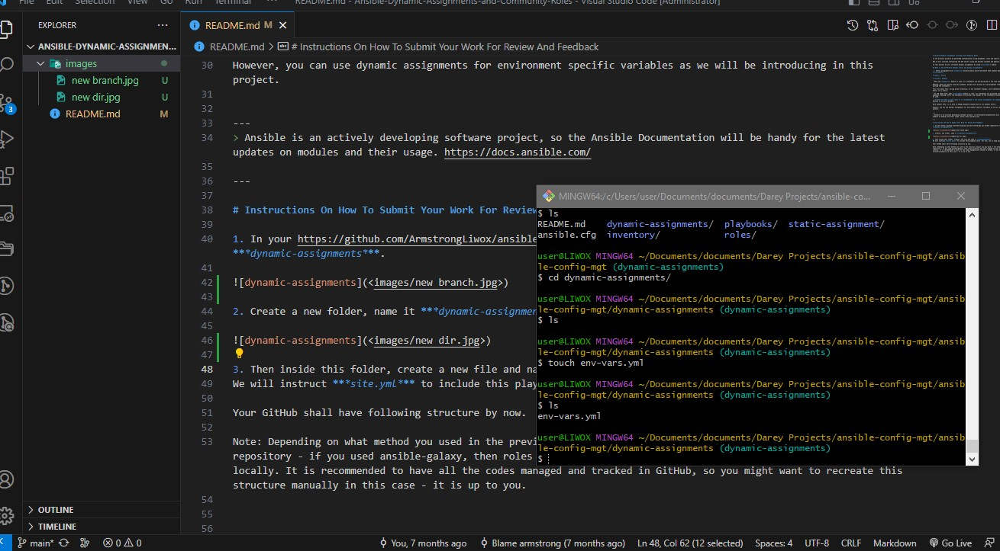
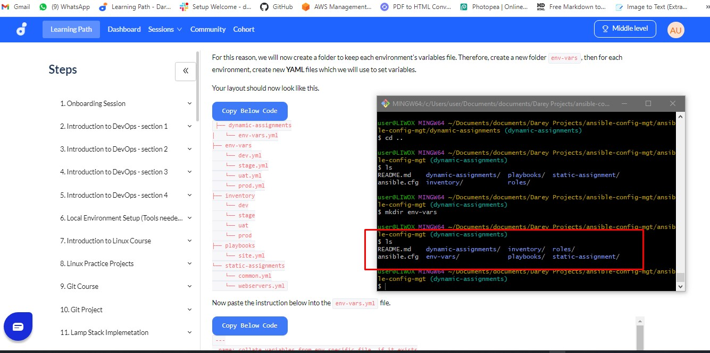
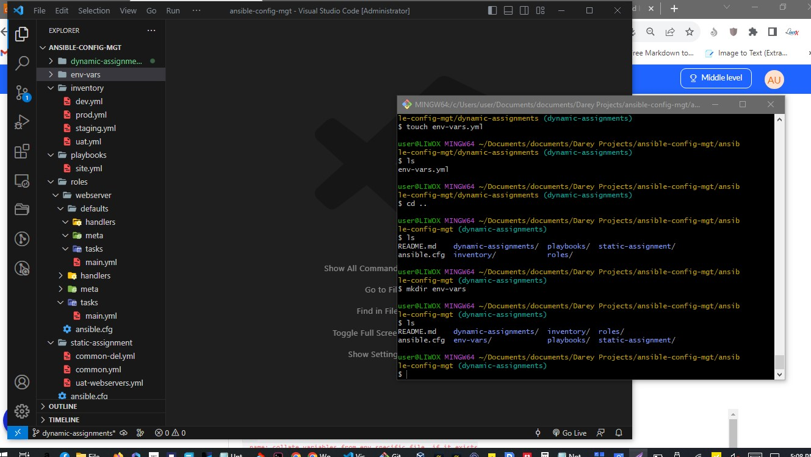

# Ansible Dynamic Assignments (Include) and Community Roles

In the previous projects we performed configurations using playbooks, roles and imports. 

Now we will continue configuring the UAT servers using new Ansible concepts and modules.

In this project we will introduce dynamic assignments by using ***include*** module.

## What is the difference between static and dynamic assignments?

> - Static assignments use ***import*** Ansible module while the module that enables dynamic assignments is ***include***.

# import = Static

# include = Dynamic

> When the ***import*** module is used, all statements are pre-processed at the time playbooks are parsed. 

Meaning, when you execute site.yml playbook, Ansible will process all the playbooks referenced during the time it is parsing the statements. 

This also means that, during actual execution, if any statement changes, such statements will not be considered. Hence, it is static.

> On the other hand, when ***include*** module is used, all statements are processed only during execution of the playbook. Meaning, after the statements are parsed, any changes to the statements encountered during execution will be used.

> ***Take note that in most cases it is recommended to use static assignments for playbooks***, 
because it is more reliable. 

With dynamic ones, it is hard to debug playbook problems due to its dynamic nature. 

However, you can use dynamic assignments for environment specific variables as we will be introducing in this project.


---
> Ansible is an actively developing software project, so the Ansible Documentation will be handy for the latest updates on modules and their usage. https://docs.ansible.com/

---

# Instructions On How To Submit Your Work For Review And Feedback

1. In your https://github.com/ArmstrongLiwox/ansible-config-mgt.git GitHub repository start a new branch and call it ***dynamic-assignments***.


2. Create a new folder, name it ***dynamic-assignments***. 


3. Then inside this folder, create a new file and name it ***env-vars.yml***. 
We will instruct ***site.yml*** to include this playbook later. For now, let us keep building up the structure.




> Note: Depending on what method you used in the previous project you may have or not have roles folder in your GitHub repository - if you used ansible-galaxy, then roles directory was only created on your Jenkins-Ansible server locally. It is recommended to have all the codes managed and tracked in GitHub, so you might want to recreate this structure manually in this case - it is up to you.

> Since we will be using the same Ansible to configure multiple environments, and each of these environments will have certain unique attributes, such as servername, ip-address etc., we will need a way to set values to variables per specific environment.

> - For this reason, we will now create a folder to keep each environment's variables file. 
Therefore, create a new folder ***env-vars***, then for each environment, create new YAML files which we will use to set variables.






## Now paste the instruction below into the ***env-vars.yml*** file.

```
---
- name: collate variables from env specific file, if it exists
  hosts: all
  tasks:
    - name: looping through list of available files
      include_vars: "{{ item }}"
      with_first_found:
        - files:
            - dev.yml
            - stage.yml
            - prod.yml
            - uat.yml
          paths:
            - "{{ playbook_dir }}/../env-vars"
      tags:
        - always
```


### Notice 3 things to notice here:

- 1. We used ***include_vars*** syntax instead of ***include***.

This is because Ansible developers decided to separate different features of the module. 

From Ansible version 2.8, the ***include*** module is deprecated and variants of include_* must be used. 

These are:

- include_role
- include_tasks
- include_vars

In the same version, variants of import were also introduces, such as:

- import_role
- import_tasks

2. We made use of a special variables ***{{ playbook_dir }}*** and ***{{ inventory_file }}***. 

- {{ playbook_dir }} will help Ansible to determine the location of the running playbook, and from there navigate to other path on the filesystem. 

- {{ inventory_file }} on the other hand will dynamically resolve to the name of the inventory file being used, then append .yml so that it picks up the required file within the ***env-vars*** folder.

3. We are including the variables using a loop. 

with_first_found implies that, looping through the list of files, the first one found is used. 

This is good so that we can always set default values in case an environment specific env file does not exist.


# Update site.yml with dynamic assignments

Update ***site.yml*** file to make use of the dynamic assignment. 

At this point, we cannot test it yet. We are just setting the stage for what is yet to come. 

***site.yml*** now look like this.

```
---
- hosts: all
- name: Include dynamic variables 
  tasks:
  import_playbook: ../static-assignments/common.yml 
  include: ../dynamic-assignments/env-vars.yml
  tags:
    - always

-  hosts: webservers
- name: Webserver assignment
  import_playbook: ../static-assignments/webservers.yml

```


